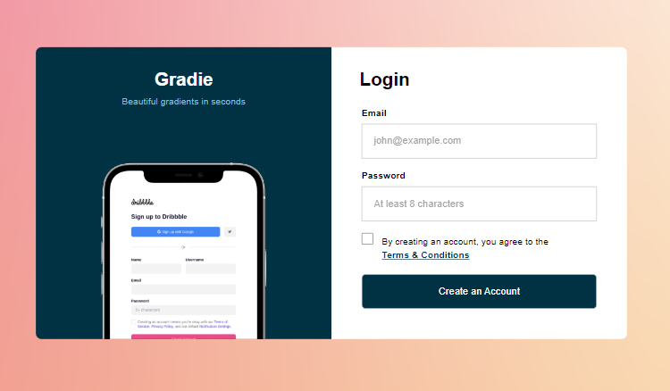

# Gradie-Signup page

This a brand sign-up page challenge from codewell.com, made with HTML and CSS. It has a responsive layout. The [original challenge](https://www.codewell.cc/challenges/gradie-sign-up-page--608ac420650dff001599e8ec) can be viewed for comparison.

### The challenge

Users should be able to:

- View the optimal layout for the site depending on their device's screen size
- See hover states for button
- Input content in all input fields

### Design

For design files, check [here](https://www.codewell.cc/challenges/gradie-sign-up-page--608ac420650dff001599e8ec)



### Links

- Live Site URL: [click here](https://lanietodev.github.io/gradie-sign-up/)

## My process

### Built with

- Semantic HTML5 markup
- CSS custom properties
- Flexbox
- Media queries
- Mobile-first workflow

### What I learned

This is my first smooth running project, I improved my use of media queries and flexbox. 

I learnt how to use different psuedo selectors.
```css
input[type=submit]{
  width:100%;
}
:not(input[type=submit]){
  width:100%;
}
```

### Continued development

I'd like to implement Javascript for interactivity in the future.

### Useful resources

- [W3schools-Selectors](https://www.w3schools.com/cssref/css_selectors.php) - This helped me for selectors in the styling phase. It really helped with understanding peudo selectors too.


## Author

- Website - [DevwithLanie Blog](https://www.devwithlanie.hashnode.dev)
- Frontend Mentor - [@lanietodev](https://www.frontendmentor.io/profile/lanietodev)
- Twitter - [@lanietodev](https://www.twitter.com/lanietodev)
